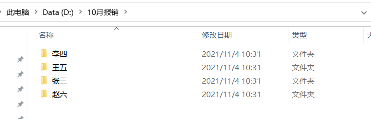
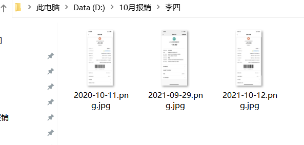
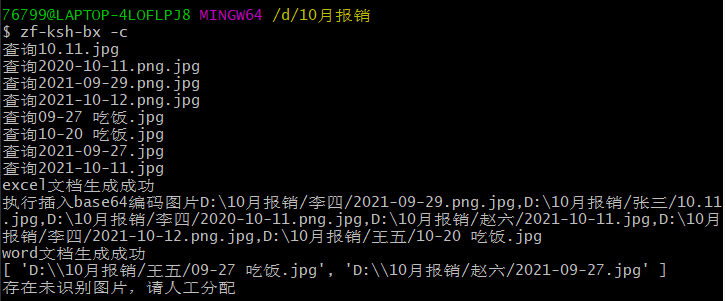
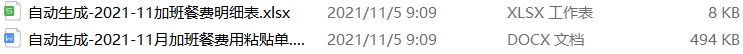

#zf-ksh-bx

基于百度OCR识别，根据支付记录快速生成多人加班餐明细表和加班餐费用粘贴单，方便报销。

##如何使用：
1.安装nodejs，版本>12 推荐下载官网稳定版本[点击这里下载](http://nodejs.cn/)

2.使用npm全局安装zf-ksh-bx
>npm install -g zf-ksh-bx

下载缓慢可以使用淘宝镜像

>npm install -g zf-ksh-bx --registry=https://registry.npm.taobao.org

3.准备好需要报销的餐费截图，多人请整理成一个文件夹
>
> 
>文件夹内为报销截图，目前支持微信、支付宝截图
> 
> 

4.在报销的文件目录，例子为【10月报销】中打开命令窗口，运行指令
>zf-ksh-bx -c

即可在目录下生成报销用的内容按照时间排序的excel和word文件

目前插件支持支付宝支付截图和微信支付截图，其他支付方式和无法识别的图片会在运行目录下的盘【未识别图片】文件夹存放，待后续人工处理。

##替换百度OCR识别KEY

插件使用百度的开发平台key，免费key仅支持200条识别/月，大量的图片识别请自行申请免费的开放平台key。地址：https://ai.baidu.com/ai-doc/REFERENCE/Ck3dwjgn3

申请后控制台调用指令

>zf-ksh-bx -s 你的api_key 你的secret_key

即可使用自己的key进行调用

###使用后建议进行人工核对，保证数据的准确性